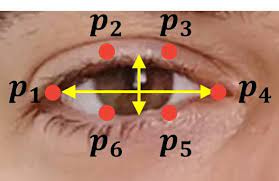

# 🚗 Système de Détection de la Fatigue du Conducteur (PFE)

Ce projet de fin d'études développe une solution intelligente de surveillance en temps réel de la vigilance du conducteur, combinant la vision par ordinateur et l'IoT pour prévenir les accidents liés à la somnolence.

---

## 📋 Table des matières
1. [Objectif du Projet](#-objectif)
2. [Structure et Approches](#-contenu-du-projet)
3. [Démonstrations Visuelles et Vidéos](#-démonstrations-visuelles--vidéos)
4. [Prérequis et Installation](#-prérequis)
5. [Guide d'Utilisation](#-exécution)
6. [Auteurs](#-auteurs)

---

## 🎯 Objectif
L’objectif est de surveiller l’état du conducteur en temps réel et d’identifier des signes de fatigue tels que :
- La fermeture fréquente des yeux (paupières lourdes)[cite: 16, 18]
- Les clignements anormaux par minute[cite: 16, 18]
- Les bâillements répétés[cite: 16, 18]
- L'inclinaison de la tête et l'assoupissement[cite: 17, 18]

---

## 📂 Contenu du Projet

### 1. Détection par Yeux et Bouche (`Dlib.ipynb`)
Cette approche utilise[cite: 16, 18] :
* **OpenCV** pour la capture du flux vidéo[cite: 16, 18].
* **Dlib** et le prédicteur à 68 points pour la localisation faciale[cite: 16, 18].
* Le calcul de l'**EAR** (*Eye Aspect Ratio*) pour mesurer l'ouverture des yeux[cite: 16, 18].
* Le calcul du **MAR** (*Mouth Aspect Ratio*) pour détecter les bâillements[cite: 16, 18].

### 2. Détection par Pose de la Tête (`Mediapipe.ipynb`)
Cette approche utilise[cite: 17, 18] :
* **MediaPipe Face Mesh** pour le suivi des repères du visage[cite: 17, 18].
* L'estimation de la pose 3D de la tête (*SolvePnP*) pour identifier les angles de bascule et l'assoupissement[cite: 17, 18].

---

## 📸 Démonstrations Visuelles & Vidéos

### 📐 Schéma explicatif de l'indice EAR (Yeux)


### 🎥 Vidéo de démonstration : Système Matériel (Capteur BPM)
<video src="assets/Vidéo-sans-titre.mp4" controls width="100%"></video>

### 📱 Vidéo de démonstration : Application et Alertes de Fatigue
<video src="assets/Untitled-video.mp4" controls width="100%"></video>

---

## 🛠️ Prérequis

Assurez-vous d’avoir Python installé sur votre machine. Installez les bibliothèques nécessaires avec la commande :

```bash
pip install numpy opencv-python imutils dlib mediapipe scipy
